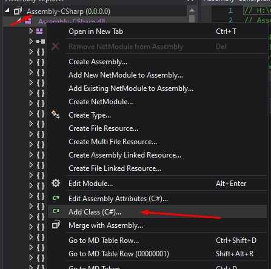

#Foto2Vam

This is a fork of [https://github.com/ChrisTopherTa54321/foto2vam](https://github.com/ChrisTopherTa54321/foto2vam)

# Training

In order to train you need to run modded VaM and use `Tools/TrainSelf.py` to communicate with VaM. In order to run this 
successfully you must first modify the main game assembly to get past scripting limitations. Using dnSpy or a similar
program add the following class to your main assembly `Assembly-CSharp`: [VamMod](Utils/VamMod/ClassLibrary1/VaMMod.cs)



Paste the content in there, press `Compile` then `File -> Save Module`. 

Now you can launch the game. Once the default scene is loaded, go to Edit mode, and in scene scripts, add [VamPlugin](Utils/VamMod/ClassLibrary1/VamPlugin.cs)
to the scene. There is no UI, you can check the logs to confirm it is working:

```logs
Creating Foto2VamServer
 
(Filename: C:\buildslave\unity\build\Runtime/Export/Debug.bindings.h Line: 43)

Foto2VamServer Created
```

Once VaM is ready, you can run the self trainer. Make sure you have setup the correct python path (use conda environments)
and ensure you have installed dependencies `pip install -r requirements-train.txt` 

Additionally you must place cuda in the path, and put this directory in your `PYTHONPATH`. Look at [setup-env](setup-env.cmd)
file for reference.

The final piece are training arguments. [train.cmd](train.cmd) has the full list. 

- configFile - is the main json configuration file, please look at example configuration files in models folder.
- outputFile - the name of the file where the model will be saved
- seedImagePath - path to read seed images, these must be normalized images, best to use from inputs foto2vam has already processed during a normal run
- tmpDir - a temporary directory to store buffer files, recommended to use a RAMDisk to avoid disk wear and tear
- seedJsonPath - a directory with a few look jsons, can be any
- trainingDataCache - name of a cache file to store tmp data during training and be able to resume training

## Config file
The configuration file looks like bellow:

```json
{
    "baseJson": "arijoon_1/base.json",
    "inputs": [{
            "name": "encoding",
            "params": [
                { "name": "angle", "value": "0" }
            ]
        },
        {
            "name": "encoding",
            "params": [
                { "name": "angle", "value": "35" }
            ]
        },
        {
            "name": "eye_mouth_ratio",
            "params": [
                { "name": "angle", "value": "0" }
            ]
        },
        ...
    ],
    "outputs": [{
        "name": "json",
        "params": []
    }]
}
```

`baseJson` is the look json you have created. You can create your own, by opening a look in vam and setting the toggle 
animatable on any morph you would like to be trainable. Additionally you can define `minJson` and `maxJson` files that
set minimum and maximum values for each trainable morph

you can also do math operations within a prams section, consult the original author post for instructions on how to do so.
Alternatively you can look at [param_generator](Utils/Training/param_generator.py) and add your math there like I have.

The rest of the process is trial and error, you can try to plot your accuracy and loss by manually capturing it in every section.

Read `TrainSelf.py` to get a better understanding of how this all works and modify as needs be.

## Landmarks

Each landmark has `w` which is it's first axis (x) and `h` which is it's second axis (y), so for example to get the distance between eyes you can use `right_eye.w - left_eye.w`

## Debugging

I have added debugging capability for both Visual studio code and Pycharm. I personally switched to Pycharm as VsCode cannot
debug multiprocess python application, and if you wish to do so, it's best to switch to IDEA based, just make sure to edit 
the debug configuration
